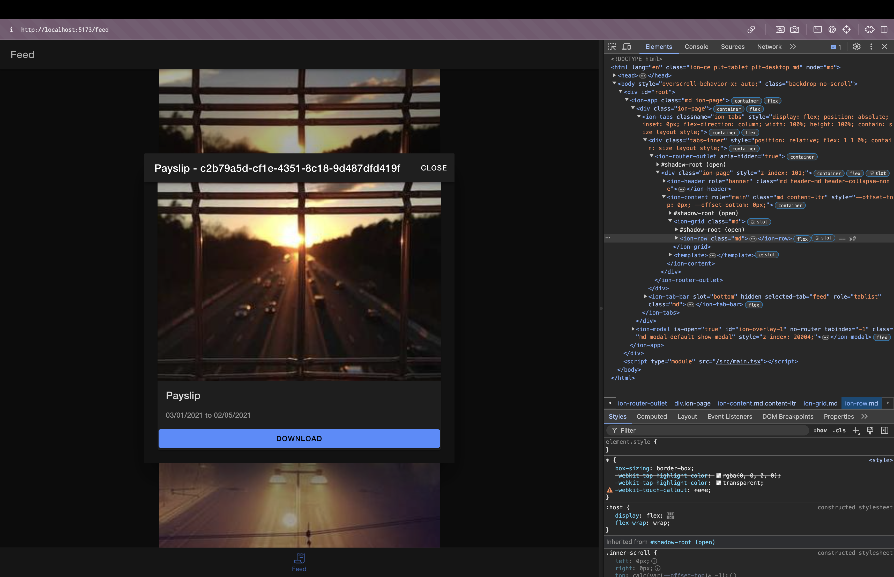

# Project Title

A Capacitor file download example.

## Description

This project shows you how to use a capacitor plugin to download and view a document from the web.

## Table of Contents

- [Installation](#installation)
- [Usage](#usage)
- [Testing](#testing)
- [Demo](#demo)
- [Contact](#contact)

## Installation

After downloading or clonig the repo, cd into the project and run `npm install`

## Usage

- web: `npm run dev`
- ios: `ionic capacitor run ios -l --external`
- android: `ionic capacitor run android -l --external`

## Testing

If you want to run all the unit and integration tests `npm run test.unit`

## Demo

- web:

  - feed 
  - post 
  - download 

- ios:

  - feed 
  - post 
  - download 

- android:

  - feed 
  - post 
  - download 

## Contact

For any questions or feedback, please contact [John Georgiadis](mailto:j.georgiadiss@gmail.com).
